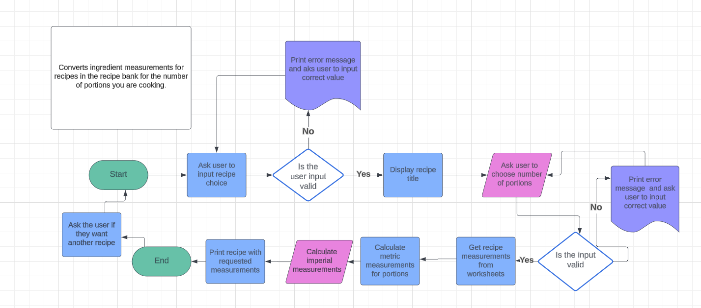

<h1 align="center">Recipe Ingredient Converter</h1>

**[View the live project here](https://recipe-converter-0e511cb84db5.herokuapp.com/) and the [Spreadsheet here]([Spreadsheet](https://docs.google.com/spreadsheets/d/1HxRmrXuh0vBWrZJDnR1j-UeINHnjVnlFtAIUtNRiUoE/edit?pli=1#gid=1522122947))**

This is a recipe ingredient conversion app. It would most probably be part of a more extensive recipe site. The apps function is to facilitate the users experience, by easily converting the recipe ingredients for number of portions, and for either metric or imperial units.

<h2 align="center"></h2>

## User Experience (UX)

-   ### User stories

    -   #### Visitor Goals

        - As a visitor/user of the conversion app, I want to easily understand how it works, the main purpose and have it facilitate my cooking by making it simple to get the correct measurements for the number of people I am cooking for.
     

## Flowchart
<h2 align="center"></h2>

## Features
[Spreadsheet](https://docs.google.com/spreadsheets/d/1HxRmrXuh0vBWrZJDnR1j-UeINHnjVnlFtAIUtNRiUoE/edit?pli=1#gid=1522122947)

## Future features and usage

### Languages Used

-   [Python](https://en.wikipedia.org/wiki/Python_(programming_language))

### Frameworks, Libraries & Programs Used

1. [gspread:](https://docs.gspread.org/en/latest/)
    - Google spreadshees was used to store the recipe ingredients, measurements and units.
2. [Git](https://git-scm.com/)
    - Git was used for version control by utilizing the Gitpod terminal to commit to Git and Push to GitHub.
2. [GitHub:](https://github.com/)
    - GitHub is used to store the projects code after being pushed from Git.
4. [Lucidchart:](https://lucid.app/)
    - Lucidchart was used to create the flowchart during initial development. To visualise theflow of the program. During the development steps were added that wern't initially in the flowchart.

## Testing

The CI Python Linter was used to check the code. On the first few checks there were some warning for long lines and white spaces which were then fixed.
-   [CI Python Linter](https://pep8ci.herokuapp.com/#) - [Results](documentation/ci_python_linter.png/)

## Further Testing

-   The apps functionality was tested all through the development process.

### Manual testing:

| Action| Description |  Result |
| ----------- | ----------- |----------- |
| Display recipe | Program fetches the recipe titles from the spreadsheet| Titles are displayed  |
| Choose recipe| The user is prompted to input a choice | You have chosen mashed potatoes. This recipe is available.  |
| Choose portions| The user is prompted to input portions| Portions: 90 Portions ✔     |
| Choose metric/imperial| The user is prompted to choose imperial/metric |  The program prints the users choice  |
| Another recipe y/n| The user is aksed if they want to cook something else. yes/no? |  no - and the program ends, yes - and the program starts again.    |
| Incorrect input for recipe| Text |    |
| Incorrect input for portions| Text |    |
| Incorrect input for metric/imperial| Text |    |


## Testing incorrect input:

| Action|  Result |
| ----------- | ----------- |
| The user presss enter without entering anything | Your choice: . No such recipe. Please choose recipe in our recipe bank.| 
| User enters incorrect recipe| Your choice: mongolian beef. No such recipe. Please choose recipe in our recipe bank.
| User enters incorrect numerical value for portions |Portions: 0 Not a correct choice: Choose a number between 1 and 100, you provided 0 Not a valid choice. Please try again |
| User enters wrong value for metric/imperial| Please enter valid choice Please choose imperial/metric: | 
| User enters wrong value for yes/no| Invalid choice. Please enter yes or no Do you want to cook something else? (yes/no) |

## Checking conversions:

| Action| Description |  Result |
| ----------- | ----------- |----------- |
| Display recipe | Program fetches the recipe titles from the spreadsheet| Titles are displayed  |
| Choose recipe| The user is prompted to input a choice | You have chosen mashed potatoes. This recipe is available.  |
| Choose portions| The user is prompted to input portions| Portions: 90 Portions ✔     |
| Choose metric/imperial| The user is prompted to choose imperial/metric |  The program prints the users choice  |
| Another recipe y/n| The user is aksed if they want to cook something else. yes/no? |  no - and the program ends, yes - and the program starts again.    |
| Incorrect input for recipe| Text |    |
| Incorrect input for portions| Text |    |
| Incorrect input for metric/imperial| Text |    |

### Known Bugs

-   On some mobile devices the Hero Image pushes the size of screen out more than any of the other content on the page.
    -   A white gap can be seen to the right of the footer and navigation bar as a result.
-   On Microsoft Edge and Internet Explorer Browsers, all links in Navbar are pushed upwards when hovering over them.

## Deployment

### GitHub Pages

The project was deployed to GitHub Pages using the following steps...

1. Log in to GitHub and locate the [GitHub Repository](https://github.com/)
2. At the top of the Repository (not top of page), locate the "Settings" Button on the menu.
    - Alternatively Click [Here](https://raw.githubusercontent.com/) for a GIF demonstrating the process starting from Step 2.
3. Scroll down the Settings page until you locate the "GitHub Pages" Section.
4. Under "Source", click the dropdown called "None" and select "Master Branch".
5. The page will automatically refresh.
6. Scroll back down through the page to locate the now published site [link](https://github.com) in the "GitHub Pages" section.

### Forking the GitHub Repository

By forking the GitHub Repository we make a copy of the original repository on our GitHub account to view and/or make changes without affecting the original repository by using the following steps...

1. Log in to GitHub and locate the [GitHub Repository](https://github.com/)
2. At the top of the Repository (not top of page) just above the "Settings" Button on the menu, locate the "Fork" Button.
3. You should now have a copy of the original repository in your GitHub account.

### Making a Local Clone

1. Log in to GitHub and locate the [GitHub Repository](https://github.com/)
2. Under the repository name, click "Clone or download".
3. To clone the repository using HTTPS, under "Clone with HTTPS", copy the link.
4. Open Git Bash
5. Change the current working directory to the location where you want the cloned directory to be made.
6. Type `git clone`, and then paste the URL you copied in Step 3.

```
$ git clone https://github.com/YOUR-USERNAME/YOUR-REPOSITORY
```

7. Press Enter. Your local clone will be created.

```
$ git clone https://github.com/YOUR-USERNAME/YOUR-REPOSITORY
> Cloning into `CI-Clone`...
> remote: Counting objects: 10, done.
> remote: Compressing objects: 100% (8/8), done.
> remove: Total 10 (delta 1), reused 10 (delta 1)
> Unpacking objects: 100% (10/10), done.
```

Click [Here](https://help.github.com/en/github/creating-cloning-and-archiving-repositories/cloning-a-repository#cloning-a-repository-to-github-desktop) to retrieve pictures for some of the buttons and more detailed explanations of the above process.

## Creating the Heroku app

When you create the app, you will need to add two buildpacks from the _Settings_ tab. The ordering is as follows:

1. `heroku/python`
2. `heroku/nodejs`

You must then create a _Config Var_ called `PORT`. Set this to `8000`

If you have credentials, such as in the Love Sandwiches project, you must create another _Config Var_ called `CREDS` and paste the JSON into the value field.

Connect your GitHub repository and deploy as normal.

## Credits

### Code

- To import the gspread library, setting the APIs, and getting the data from this worksheet, I used the walkthrough project love-sandwich as a guide.
- [Making dict from list of tuples](https://stackoverflow.com/questions/48902085/python3-how-to-make-dictionary-from-list-using-dict-and-zip)
- [Using Zip](https://stackoverflow.com/questions/49783594/for-loop-and-zip-in-python/49783740#49783740)
- [Using slice](https://stackoverflow.com/questions/17513438/csvreader-next-function/17513447#17513447)
- [Convert a dictionary to a string](https://stackoverflow.com/ai/search/38584)
- [Writing a yes/no question](https://www.quora.com/I%E2%80%99m-new-to-Python-how-can-I-write-a-yes-no-question)
- [Convert dict to concatenated string](https://www.geeksforgeeks.org/python-convert-dictionary-to-concatenated-string/)
- [Using if in to check a list](https://www.geeksforgeeks.org/check-if-element-exists-in-list-in-python/)
- [Using Isinstance](https://ioflood.com/blog/python-isinstance-function-guide-with-examples/)
- [Using Isinstance](https://ioflood.com/blog/python-isinstance-function-guide-with-examples/)
- [if_name_equals](https://www.theserverside.com/tip/What-does-the-Python-if-name-equals-main-construct-do)
    Added after advice from mentor.
- [Using range and len](https://www.freecodecamp.org/news/python-range-function-example/)
- [Using len and range](https://stackoverflow.com/questions/19184335/is-there-a-need-for-rangelena)

### Content

-   All recipes/ingredient amounts were adapted from different recipes on the web or from my own recipes.


### Acknowledgements

-   My Mentor for continuous helpful feedback.

-   Tutor support at Code Institute for their support.
